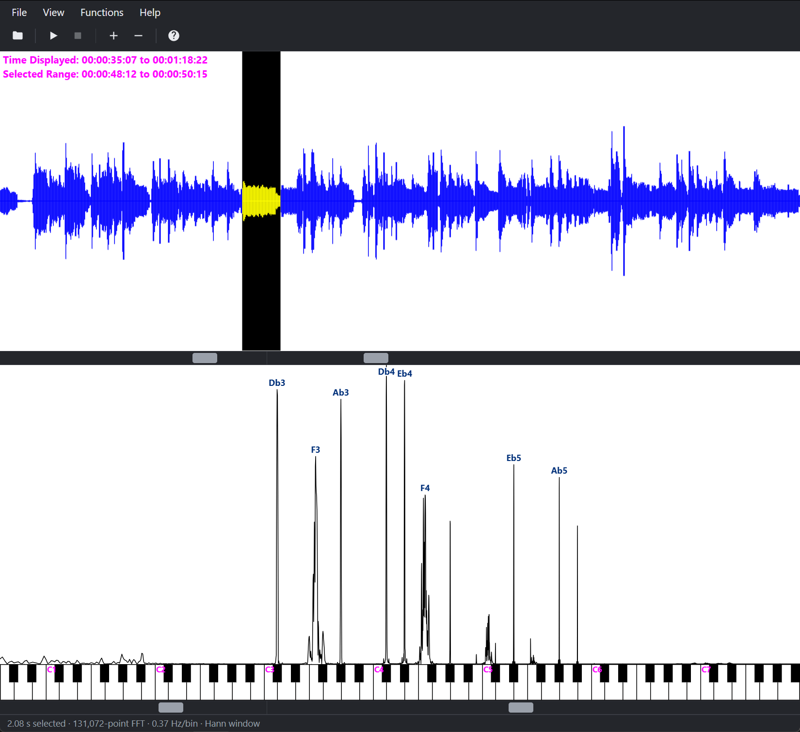

# music-explorer-web

See which notes are playing in a clip of music.

**[Try it in your browser](https://geoff604.github.io/music-explorer-web/dist/)**



Music Explorer uses Fourier Transforms to visually identify which notes are being played in a clip of music
and how music is made up of many overtones.

Music Explorer is a free tool to learn about the nature of music in a visual way. It can also be
used by musicians to help transcribe recorded music by identifying hard-to-hear chords.

It allows you to visually identify which notes are being played in a clip of music and instantly
see how music is made up of many overtones.

Open a recording, drag across the waveform to select a moment, and the frequency spectrum of that
moment appears above a piano keyboard, lined up so each spike sits over the note it belongs to.
Press a key to hear its pitch and check it against a spike. It is a visual way to learn how music
is built from overtones, and a help for transcribing chords that are hard to hear.

This is a browser port of the Windows program written in 2003 by Geoff Peters and Gabriel Lo
(C++/MFC, available at https://github.com/geoff604/music-explorer).

Your audio never leaves the page: files are decoded and analysed locally.

## Using it

1. **Open** an audio file (`Ctrl+O`, the toolbar, or drop one on the page). Anything your browser
   can decode works: WAV, MP3, M4A/AAC, OGG, FLAC.
2. **Select a range** by dragging across the waveform, or use *Functions → Select Range…* to type
   exact SMPTE times (`hours:minutes:seconds:frames`, 30 frames per second).
3. **Read the spectrum.** Spikes over the piano keys are the notes present. Small labels name the
   strongest peaks.
4. **Press a piano key**, or click anywhere on the spectrum, and hold it to hear that pitch. Its MIDI
   number and name, e.g. `Key Pressed: 60 (C4)`, appear in the top left corner of the spectrum.
5. **Play** the selection (`Space`). With no selection it plays from the start point to the end.

### Controls

- Select a part of the waveform by clicking and dragging, to analyze what notes are in that section
  of music.
- Zoom in and out with the zoom controls or your mouse wheel.
- Pan left and right with the scroll bars, or by right-clicking and dragging.
- On a phone or tablet, drag with two fingers to pan and pinch with two fingers to zoom.
- Use the space bar (or the play button in the top toolbar) to start and stop the audio.
- To zoom the waveform vertically in or out, use the top toolbar.

*View → Window* switches between a **Hann** window (default; sharper peaks) and the original's
**rectangular** window.

## Differences from the 2003 program

**Kept exactly:** the pitch axis (`12·log2(f/440)` semitones, padded ±½ so each note is centred over
its key), the equal-width keyboard, mu-law (µ = 255) vertical scaling auto-fitted to the loudest
visible bin, raw-power intensity, the 120-ticks-per-second time grid, the per-tick mean-absolute
waveform, and the wavetable tone generator with its truncated phase increment. Even the magenta time
readouts are kept: in the original they were an accident of shared drawing state, and they are part of
how the app looks.

**Changed on purpose:**

| Original | Now |
|---|---|
| Rectangular window only | Hann by default, rectangular available |
| Truncated a selection down to a power of two, discarding audio | Zero-pads up; very long selections are Welch-averaged |
| Middle C labelled C5 | Middle C is C4 (standard pitch notation) |
| F was named "Fb" | F |
| Select Range accepted any values | End must follow start and lie inside the file |
| Crashed if you selected during playback | Cannot happen |
| Piano tone clicked on start, stop and when changing pitch | 10 ms eased fades; each key sounds on its own voice (up to four), so a new key crossfades with the one before instead of retuning it |
| No playhead, selection shown only after release | Playhead; live selection while dragging |

Note names use flats (Db, Eb, Gb, Ab, Bb), as the original did.

**Caveat:** browsers resample audio to the audio context's rate when decoding (often 48 kHz). Pitch
analysis below Nyquist is unaffected, but frequencies above 20 kHz are not something this tool is
meant for.

## Developing

```
npm install
npm run dev        # dev server
npm run dev:phone  # dev server for testing on a phone over your network (see below)
npm test           # unit tests (Vitest)
npm run build      # typecheck + production build into dist/
```

The build is a static site (`base: './'`), so `dist/` can be served from any path.

To test on a phone, run `npm run dev:phone` and open the `Network` address it prints on a phone
that is on the same network.

Use `dev:phone` instead of `npm run dev` for this. On a phone, opening the file picker sends the
browser tab to the background and drops its connection to the dev server, which makes the normal dev
page reload itself, so choosing a file would reload the page. `dev:phone` avoids that, but has no
live reload: refresh the page by hand after each edit.

Over plain `http`, the piano tone uses a fallback because `AudioWorklet` requires `https`.

The analysis code is in `src/core/` and has no DOM dependencies, so it is fully unit-tested; the
canvas views and controller are in `src/ui/`, and playback and the tone generator in `src/audio/`.

## Licence

GNU General Public License, version 3 or (at your option) any later version. See [LICENSE](LICENSE)
and [NOTICE](NOTICE).

## Source code

The source code and issue tracker are on GitHub:
<https://github.com/geoff604/music-explorer-web>
